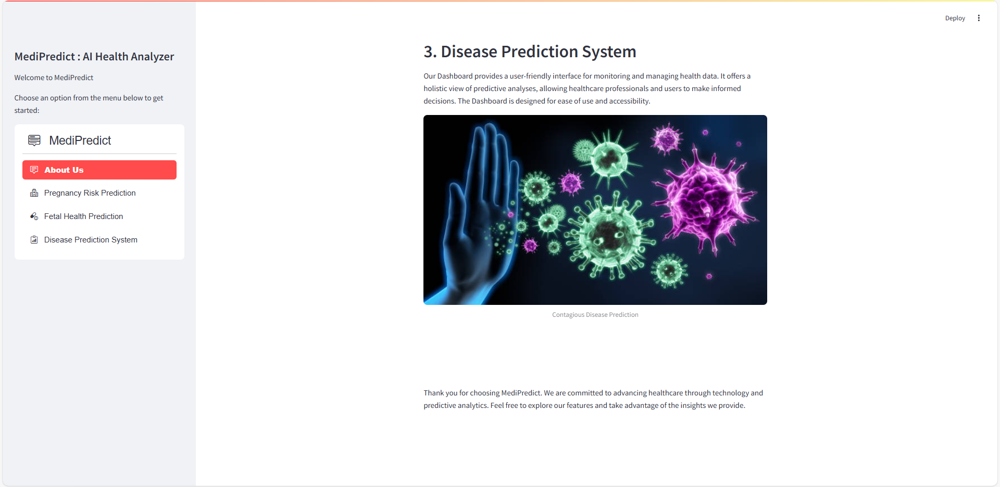
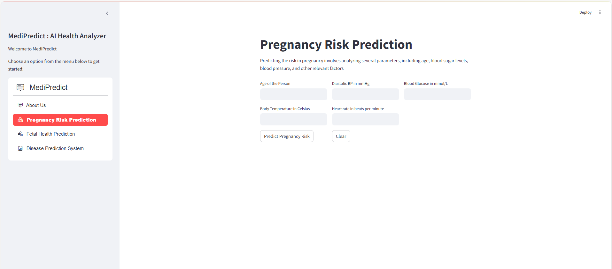
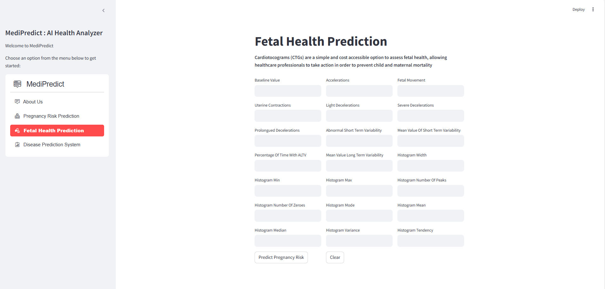

# **MediPredict: AI Health Analyzer**

## **Introduction**

Welcome to MedPredict: AI Health Analyzer, an innovative platform dedicated to advancing maternal health risks,fetal health and diseases based on symptoms through predictive analysis. MedPredict empowers healthcare professionals and users alike by providing accurate predictions and proactive risk management related to pregnancy.

## **Project Overview**

This project leverages machine learning to predict maternal health risks, fetal health conditions, and diseases based on symptoms. It uses supervised learning (Algorithms like LogisticRegression, K-Nearest Neighbour, Random Forest, Gradient Boosting and chooses the best algorithm among them) and unsupervised learning (K-Means clustering) to provide accurate medical predictions.


## **Key Objectives**

* Predict maternal health risks (hypertension, diabetes, pregnancy complications).

* Classify fetal health (normal, suspect, pathological).

* Detect diseases from symptoms using NLP.

* Provide real-time predictions via user input.

## **Key Features**

1. Pregnancy Risk Prediction: Our Pregnancy Risk Prediction feature utilizes advanced algorithms to analyze various parameters, including age, body sugar levels, blood pressure, and more. By processing this information, we provide accurate predictions of potential risks during pregnancy.


2. Fetal Health Prediction: Cardiotocograms (CTGs) are a simple and cost accessible option to assess fetal health, allowing healthcare professionals to take action in order to prevent child and maternal mortality


3. Symptom-Based Disease Detection: 
Our Disease Prediction feature leverages advanced machine learning algorithms to analyze patient-reported symptoms and identify potential health conditions. By processing text-based symptom descriptions using Natural Language Processing (NLP) techniques, our system can recognize patterns and correlate them with known diseases.

<p align="center">
     
    
</p>
<p align="center">
    
</p>

<p align="center">
    
</p>
<p align="center">
    

</p>


## **How to Run the Streamlit Code**

Follow these steps to run the Streamlit code locally:

### Clone the Repository

```
https://github.com/Gaje1109/UPTOR_106_FINAL_PROJECT_GAJENDRAN.git
```
### Install Dependencies

 ```
pip install -r requirements.txt
 ```

 ### Run the Streamlit App
 ```
streamlit run main.py
```
This will launch the Streamlit app locally. Open your web browser and navigate to the provided local address to explore MedPredict.


Developer Name: R.Gajendran
